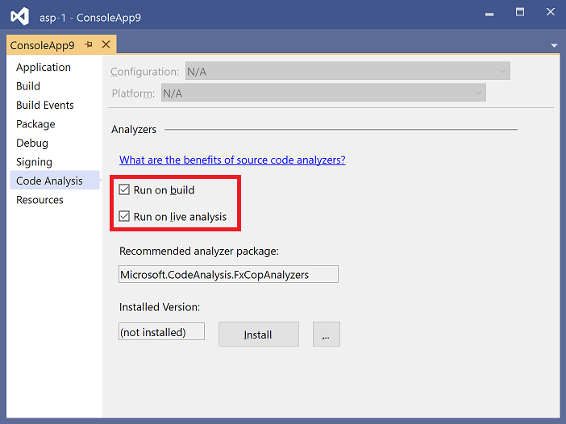

# Disable source code analysis for .NET

::: moniker range=">=vs-2019"

This page helps you disable code analysis in Visual Studio. There are limitations to what you can disable, and the procedure for turning off code analysis differs depending on a few factors:

- Project type (.NET Core/Standard versus .NET Framework)

  .NET Core and .NET Standard projects have options on their Code Analysis properties page that let you turn off code analysis from analyzers installed as a NuGet package. For more information, see [.NET Core and .NET Standard projects](#net-core-and-net-standard-projects). To turn off source code analysis for .NET Framework projects, see [.NET Framework projects](#net-framework-projects).

- Source analysis versus legacy analysis

  This topic applies to source code analysis and not to legacy (binary) analysis. For information about disabling legacy analysis, see [How to: Enable and disable legacy code analysis](how-to-enable-and-disable-automatic-code-analysis-for-managed-code.md).

## .NET Core and .NET Standard projects

Starting in Visual Studio 2019 version 16.3, there are two checkboxes available in the Code Analysis properties page that let you control whether analyzers run at build time and design time. These options are project-specific.



To open this page, right-click the project node in **Solution Explorer** and select **Properties**. Select the **Code Analysis** tab.

- To disable source analysis at build time, uncheck the **Run on build** option.
- To disable live source analysis, uncheck the **Run on live analysis** option.

> [!NOTE]
> Starting in Visual Studio 2019 version 16.5, if you prefer the on-demand code analysis execution workflow, you can disable analyzer execution during live analysis and/or build and manually trigger code analysis once on a project or a solution on demand. For information about running code analysis manually, see [How to: Run Code Analysis Manually for Managed Code](how-to-run-code-analysis-manually-for-managed-code.md).

## .NET Framework projects

To turn off source code analysis for analyzers, add one or more of the following MSBuild properties to the [project file](../ide/solutions-and-projects-in-visual-studio.md#project-file).

| MSBuild property | Description | Default |
| - | - | - |
| `RunAnalyzersDuringBuild` | Controls whether analyzers run at build time. | `true` |
| `RunAnalyzersDuringLiveAnalysis` | Controls whether analyzers analyze code live at design time. | `true` |
| `RunAnalyzers` | Disables analyzers at both build and design time. This property takes precedence over `RunAnalyzersDuringBuild` and `RunAnalyzersDuringLiveAnalysis`. | `true` |

Examples:

```xml
<RunAnalyzersDuringBuild>false</RunAnalyzersDuringBuild>
<RunAnalyzersDuringLiveAnalysis>false</RunAnalyzersDuringLiveAnalysis>
<RunAnalyzers>false</RunAnalyzers>
```

::: moniker-end

::: moniker range="vs-2017"

## Source analysis

You cannot turn off [source analysis](roslyn-analyzers-overview.md) in Visual Studio 2017. If you want to clear analyzer errors from the **Error List**, you can suppress all the current violations by selecting **Analyze** > **Run Code Analysis and Suppress Active Issues** on the menu bar. For more information, see [Suppress violations](use-roslyn-analyzers.md#suppress-violations).

Starting in Visual Studio 2019 version 16.3, you can turn off source code analysis or execute it on demand. Consider upgrading to Visual Studio 2019.

## Legacy analysis

You can disable legacy, build-time analysis on the **Code Analysis** properties page. For more information, see [How to: Enable and disable legacy code analysis](how-to-enable-and-disable-automatic-code-analysis-for-managed-code.md).

::: moniker-end

## See also

- [Suppress violations](use-roslyn-analyzers.md#suppress-violations)
- [How to: Enable and disable legacy code analysis](how-to-enable-and-disable-automatic-code-analysis-for-managed-code.md)
