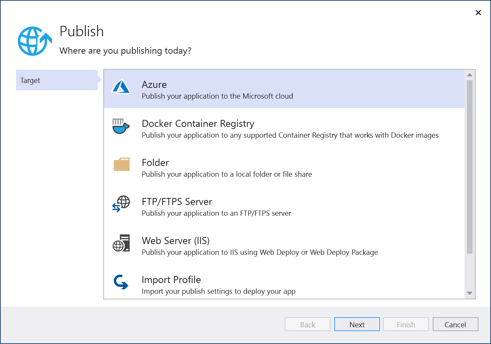
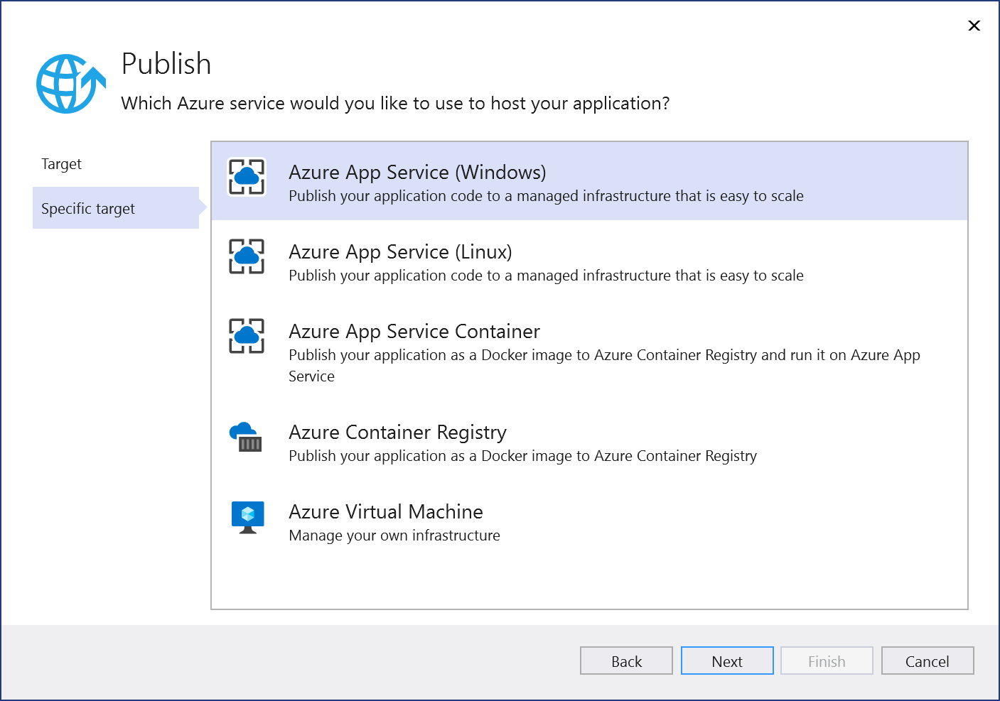
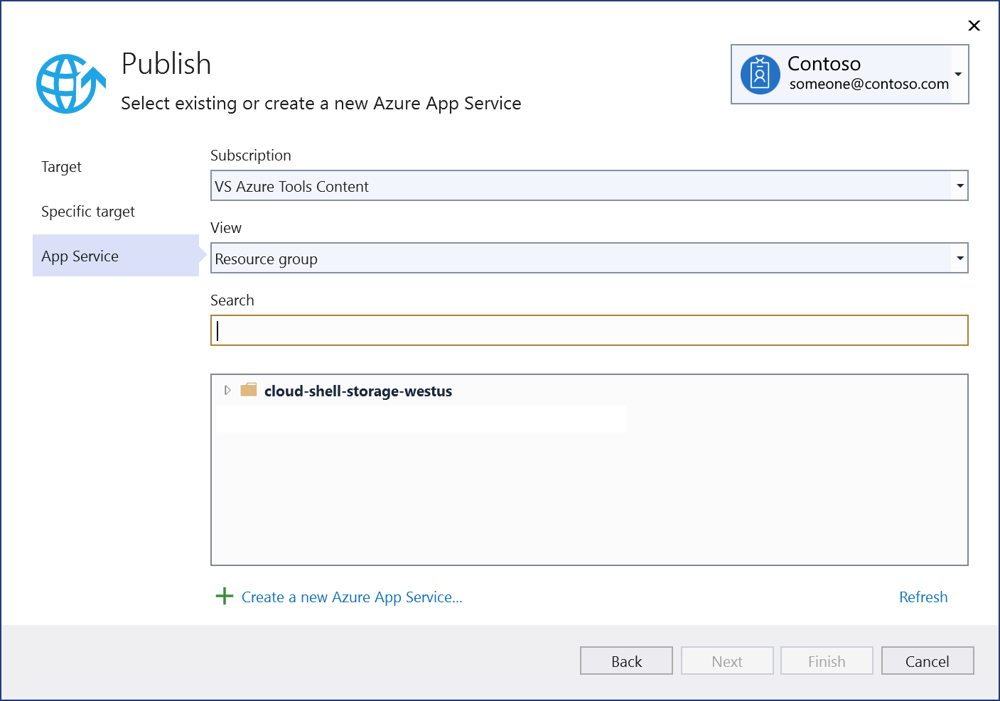
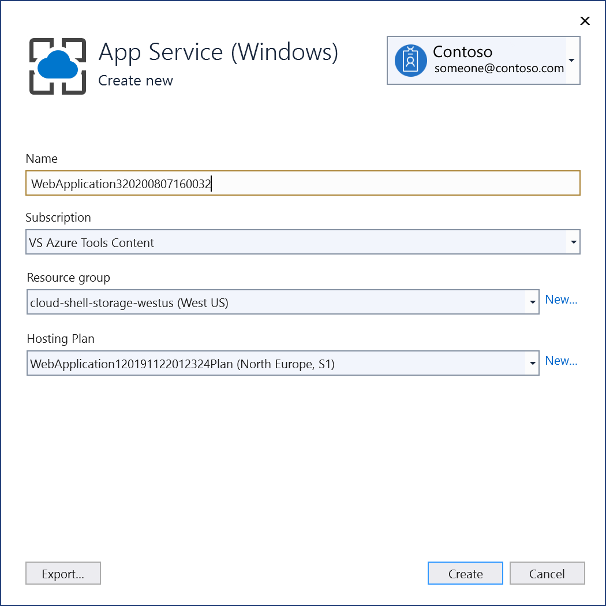
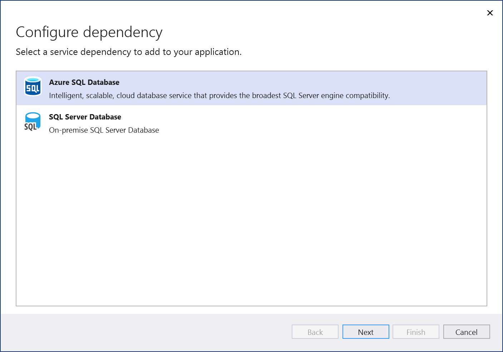
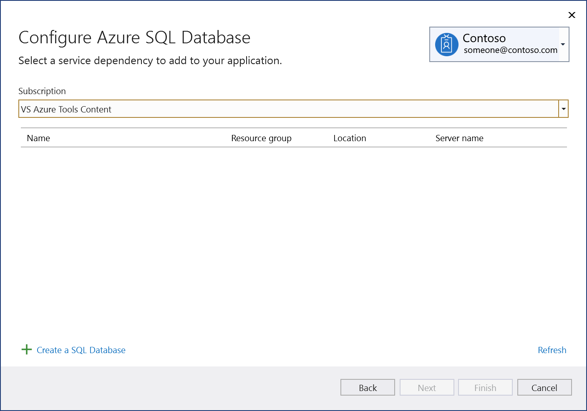
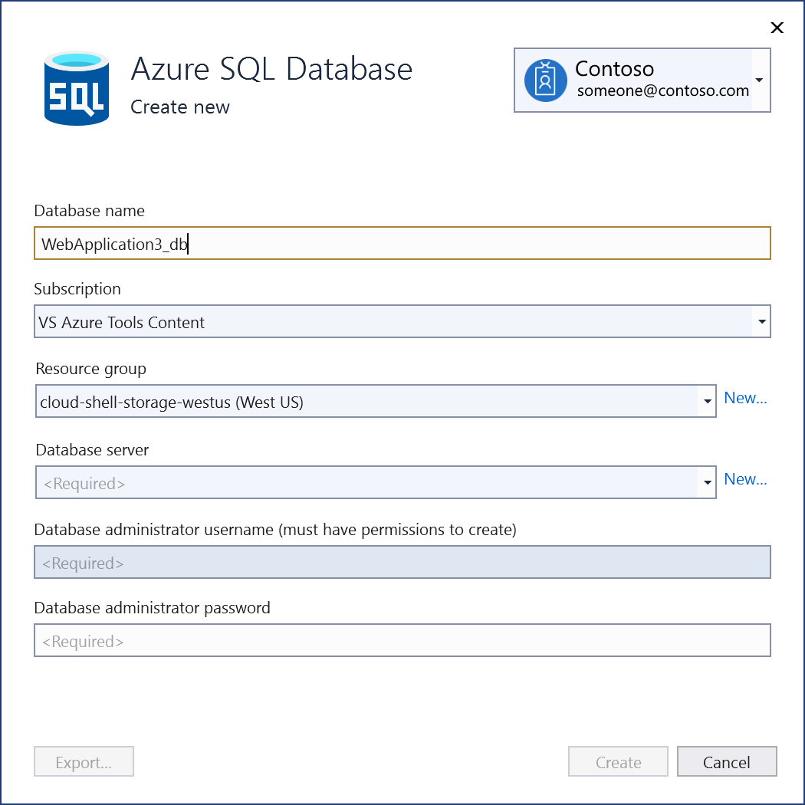
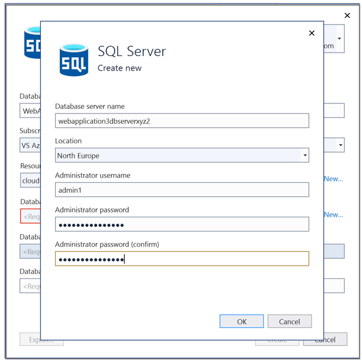

# Step 5: Deploy your ASP.NET Core app to Azure

Follow these steps to deploy your ASP.NET Core app and its database to Azure.

_Watch this video and follow along to deploy your first ASP.NET Core app to Azure._

> [!VIDEO https://www.youtube.com/embed/n8wz_f5_4wI]

## Open your project

Open your ASP.NET Core app in Visual Studio 2019. The app should already be using set up with EF Core and a working web API, as configured in [step 4 of this tutorial series](tutorial-aspnet-core-ef-step-04.md).

## Publish to Azure App Service

1. Right-click on the project in solution explorer and choose **Publish**. In the **Publish** wizard, choose **Azure** as the target.

   

1. For the specific target, choose **Azure App Service (Windows)**.

   

1. Choose **Create a new Azure App Service**. If you don't already have an Azure account, click the **Create your Free Azure Account** and complete the brief registration process.

   

1. Specify a name and resource group, or accept the default values, and choose **Create**. A resource group is just a way of organizing related resources in Azure, such as services that work together with storage accounts, key vaults, and databases.

   

1. Choose **Finish**. The resources are created in Azure, the app is deployed, and the **Publish** tab is populated with the information about what you just created. The **Publish** tab provides a button to publish with one click with the same configuration, shows configuration details, or lets you add services such as a database.

Now, add an Azure SQL Server database.

1. On the **Publish** tab, under **Service Dependencies**, next to **SQL Server database**, choose **Configure**.

1. On the next screen, choose **Azure SQL Database**.

   

1. On the **Configure SQL Database** screen, choose **Create a SQL Database**.

   

1. On the **Azure SQL Database: Create new** screen, create a new database server.

   

1. On the **SQL Server: Create new** screen, choose a name, location, and specify an administrator username and password.

   

## Exploring the Azure portal and your hosted app

Once the app service is created your site will launch in a browser. While it's loading you can also find the App Service in the Azure portal. Exploring the available options for your app service you'll find an **Overview** section where you can start and stop the app.

### Scalability

You can examine the options to scale the app up as well as out. Scaling up refers to increasing the resources given to each instance hosting your app. Scaling out refers to increasing the number of instances hosting your app. You can configure autoscale for your app, which will automatically increase the number of instances used to host your app in response to load,and then reduce them once the load has decreased.

### Security and compliance

Another benefit of hosting our app using Azure is security and compliance. Azure App Service provides ISO, SOC, and PCI compliance. We can choose to authenticate users with Azure Active Directory or social logins like Twitter, Facebook, Google,or Microsoft. We can create IP restrictions, manage service identities, add custom domains, and support SSL for the app, as well as configure backups with restorable archive copies of the app’s content, configuration, and database. These features are accessed in the Authentication / Authorization, Identity, backups, and SSL Settings menu options.

### Deployment slots

Frequently when you deploy an app, there’s a small period of downtime while the app restarts. Deployment Slots avoid this issue by allowing you to deploy to a separate staging instance or set of instances and warm these up before swapping them into production. The swap is just an instant and seamless traffic redirection. If there are any issues in production after the swap, you can always swap back to your last known good production state.

## Update connection string

By default Azure expects a new app's connection to its new SQL Server database to use a connection string named `DefaultConnection`. Currently the app we created earlier in this tutorial series uses a connection string named `AppDbContext`. We need to change this in *appsettings.json* and *Startup.cs* and then redeploy the app.

## Test the app running in Azure

Navigate to the */Games* path and you should be able to add a new game and see it listed. Next, navigate to the */swagger* path and you should be able to use the web API endpoints from there to confirm the app's API is working as well.

Congratulations! You've completed this video tutorial series!

## Next steps

Learn more about how to architect ASP.NET Core applications with these free resources.

[ASP.NET Core Application Architecture](https://dotnet.microsoft.com/learn/web/aspnet-architecture)

## See also

- [Publish an ASP.NET Core app to Azure with Visual Studio](/aspnet/core/tutorials/publish-to-azure-webapp-using-vs?view=aspnetcore-2.2&preserve-view=true)